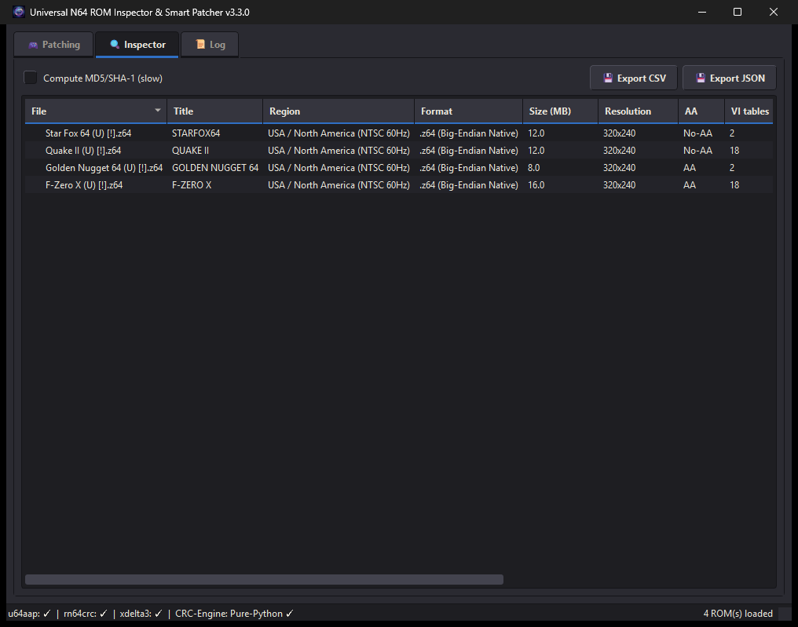

# 🎮 Universal N64 ROM Inspector & Smart Patcher


A modern, high-performance GUI + CLI ROM patcher and inspection utility for Nintendo 64 games. Features the **Smart VI Mode Table Engine v2.0** for structurally-verified 640x480 high-resolution patching, anti-aliasing (No-AA) removal, dither/divot/gamma filter toggles, SubDrag `.xdelta` integration, preset profiles, archive extraction, and Flashcart CRC/Header tools.

**Cross-platform**: the bundled Windows helpers (`u64aap.exe`, `rn64crc.exe`, `xdelta3.exe`) are used when runnable, with graceful fallbacks everywhere else — a **built-in pure-Python CRC1/CRC2 engine** (works on macOS/Linux), the dynamic VI instruction patcher for No-AA, and an optional system `xdelta3` from PATH.

Designed for use with real N64 hardware, FPGA consoles (Analogue 3D, ModRetro M64), flashcarts (SummerCart 64, EverDrive 64), and N64 emulators (Simple64, Ares, RMG).

---

## ✨ Key Features

- **🎯 Smart VI Mode Table Engine v2.0**:
  - Structural data pattern matching using 32-bit width words (`0x00000140`) paired with hardware NTSC/PAL/M-PAL burst-timing signatures (`0x03E52239`, `0x0404233A`, `0x04651E39`).
  - **Structurally constrained**: only width fields immediately followed by a
    known burst constant are modified, so unrelated data that merely contains
    `0x00000140` is left alone. See *Technical Details* for what this does and
    does not guarantee.
  - The CRC engine behind every patched output is measured: it reproduces the
    publisher's stamped checksums on **1,492 of 1,496** real ROMs
    (see *Validation against a real ROM library*). End-to-end patch
    compatibility is not claimed as a single number - generate it for your own
    collection with `--verify-report`.

- **📋 One-Click Preset Profiles**:
  - `📺 CRT Authentic`: Preserves original N64 blur for CRT displays.
  - `✨ Modern Crisp`: Disables VI Anti-Aliasing and Dithering for sharp edges on flat screens.
  - `🚀 Modern 4K`: Enables 640x480 Hi-Res VI Mode Table Engine & No-AA for 4K / FPGA.
  - `⚡ Speedrun Safe`: Minimal non-intrusive patches; preserves standard resolution and logic.

- **💾 Flashcart & EverDrive Compatibility Tools**:
  - **Scene-Header Stripper**: Automatically detects and strips obsolete 512/1024-byte scene release headers (`iN0000`, `PARADOX`, etc.) so `.xdelta` patches and cover arts match cleanly.
  - **CRC1 / CRC2 Checksum Repairer**: Recalculates and updates N64 boot checksums to prevent blackscreen boots on real hardware — via `rn64crc.exe` when it is runnable *and* its output actually verifies, otherwise via the **built-in pure-Python CRC engine** (macOS/Linux included).

- **📦 Archive & Community Patch Support**:
  - **Direct Archive Support**: Processes `.zip` and `.7z` archives directly.
  - **IPS & BPS Patching**: Applies `.ips` and `.bps` community patches seamlessly.

- **🔥 SubDrag `.xdelta` Community Patch Integration**:
  - Automatically detects and applies verified high-res patches for *Super Mario 64*, *GoldenEye 007*, *Banjo-Kazooie*, *F-Zero X*, *Forsaken 64*, *Pokemon Snap*, *Quake II*, and *Golden Nugget 64*.

- **🚀 Multi-Threaded Batch Runner**:
  - Parallel ThreadPoolExecutor batch processing. A bad file cannot crash the run, output is logged from a single thread, and Ctrl+C stops the batch while keeping everything already finished.

- **🛡️ 100% Non-Destructive**:
  - Original ROMs are **never modified or overwritten**. Always outputs a new tagged file (` [HR+NoAA].z64`).

---

## ⌨️ Command-Line Interface

The same patch engine is available headless as `n64patcher`
(equivalently `python -m n64patcher`):

```bash
# List the preset profiles and the keys --preset accepts
n64patcher --list-presets

# Show what would be done without writing any files
n64patcher "D:\N64 ROMs" --preset modern_4k -r --dry-run

# Patch a directory using the Modern 4K preset
n64patcher "D:\N64 ROMs" --preset modern_4k -r

# Write all outputs to a separate directory
n64patcher "D:\N64 ROMs" --preset modern_crisp -r -o "D:\Patched"

# Batch patch directly from a ZIP or 7z archive
n64patcher roms.zip --preset modern_crisp

# Verify every output and write a publishable pass/fail matrix
n64patcher "D:\N64 ROMs" -r --preset modern_4k --verify --verify-report matrix.csv

# Apply flashcart tools (strip scene headers + repair CRC checksums)
n64patcher "D:\N64 ROMs" -r --strip-header --fix-crc --preset speedrun

# Apply a custom .ips or .bps community patch to all ROMs
# (applied to the CLEAN ROM; community patches target pristine dumps)
n64patcher "D:\N64 ROMs" --patch-file sm64_widescreen.ips

# Inspect a folder with MD5/SHA-1 hashes and export to CSV
n64patcher "D:\N64 ROMs" --inspect-only --export report.csv
```

Individual flags (`--keep-aa`, `--no-dither`, `--no-divot`, `--no-gamma`,
`--hires`) override the selected preset. `--fix-crc` also creates `[CRCFIX]`
copies of ROMs the engine skips (flashcart repair mode). `--verify` exits
with code 1 if any output fails its checks, which makes it usable as a gate
in scripts. Run `n64patcher --help` for the full list.

---

## 📸 Screenshots & GUI




PyQt6 interface themed after mid-90s console hardware: a faceplate strip
over a four-segment accent rule, cartridge-label panels each with a coloured
spine, chunky bevelled controls that visibly travel on press, and bitmap-era
typography (Fixedsys / Terminal where present, falling back gracefully
elsewhere). Monospace is reserved for technical readouts — filenames, table
cells, log lines — while prose stays legible in the body face.

The run control is a round red START key seated in a recessed collar,
flanked by Inspect and Cancel — the layout a 90s pad used. It is an ordinary
`QPushButton` underneath, with an accessible name and tooltip, so keyboard
and screen-reader users are unaffected by the styling.

Preset profiles lock the individual filters, shown dimmed but still ticked
so the UI never misreports what it will do. The 640x480 box reports how many
loaded ROMs actually support it. The front-panel indicator at bottom-left
tracks run state: grey idle, amber working, green clean, red errors.

---

## 🚀 Quick Start

**Windows — portable, no install**

1. Download `N64_Smart_Patcher.exe` from the **[Releases](../../releases)** tab.
2. Double-click it. SmartScreen will warn on first run (the binaries are not
   code-signed): *More info → Run anyway*.
3. Drag & drop your N64 ROMs (`.z64`, `.n64`, `.v64`, `.zip`, `.7z`) or a folder.
4. Pick a preset or set custom options and click **START**.

**macOS**

```bash
brew install xdelta                                   # needed for verified 640x480 patches
```

Then either download `N64-Smart-Patcher-macos-arm64.app.zip` (or `-x86_64` for
Intel) from Releases, or install from PyPI-style source:

```bash
pip install -e ".[gui]"
n64patcher-gui
```

The `.app` is not notarised, so the first launch needs
**right-click → Open** rather than a double-click, or
`xattr -dr com.apple.quarantine "N64 Smart Patcher.app"`.

**Linux**

```bash
sudo apt install xdelta3          # or: dnf install xdelta / pacman -S xdelta3
```

Then either download `N64-Smart-Patcher-linux-x86_64` from Releases and run
`./install-linux.sh` (installs into `~/.local`, no root; `--uninstall` removes
it again), or install from source:

```bash
pip install -e ".[gui]"
n64patcher-gui
```

**From source — any platform**

```bash
pip install -e ".[gui]"   # omit [gui] for the CLI only - it needs no dependencies
n64patcher-gui            # desktop app
n64patcher --help         # command line
```

---

## 🖥️ Platform support

The patching engine is pure standard library and behaves identically
everywhere. What differs is the three bundled helper binaries, which are
Windows executables: on macOS and Linux the tool detects that they cannot run
and takes another route.

| Stage | Windows | macOS / Linux |
|---|---|---|
| ROM inspection, CIC detection, boot CRC | built-in Python engine | **identical** |
| CRC repair | `rn64crc.exe`, falling back to the built-in engine | built-in engine only — same results |
| No-AA / dither / divot / gamma | `u64aap.exe`, falling back to the dynamic patcher | dynamic patcher |
| **Verified 640x480 patches** | bundled `xdelta3.exe` | **needs a system `xdelta3`** |
| IPS / BPS apply and create | built-in | **identical** |
| DAT lookup, manifests, batch, archives | built-in | **identical** |

Only one row actually needs something installed. The verified 640x480 patches
are xdelta deltas, and there is no correct fallback for them — the generic VI
widening renders wrong on real hardware, which is why it is gated. If
`xdelta3` is missing the tool says so and refuses the hi-res stage rather than
quietly producing a broken ROM:

```
xdelta3: verified 640x480 patches CANNOT be applied (install it with: brew install xdelta).
```

Everything else on those ROMs — No-AA, no-dither, CRC repair — still happens.

CI runs the unit suite on Ubuntu, macOS and Windows across Python 3.11/3.12/3.13,
and additionally runs `scripts/smoke_test.py` — which drives the *installed*
command line tool as a subprocess against real files — on all three, plus once
more under the C/POSIX locale.

```bash
python scripts/smoke_test.py                     # the installed package
python scripts/smoke_test.py dist/n64patcher     # a frozen binary
```

---

## 🛠️ Building & Architecture

```bash
# Clone repository
git clone https://github.com/inf1nit3/N64-Universal-Smart-Patcher.git
cd N64-Universal-Smart-Patcher

# Install. The engine and CLI have NO third-party dependencies;
# the GUI and .7z support are optional extras.
pip install -e .              # engine + CLI
pip install -e ".[gui]"       # + PyQt6 desktop app
pip install -e ".[archive]"   # + .7z archive support
pip install -e ".[all]"       # both
pip install -e ".[dev]"       # everything + pytest/ruff/mypy/pyinstaller

# Run the unit suite (synthetic ROMs, no game files needed)
python -m pytest

# Drive the installed CLI end to end as a subprocess. Catches the packaging
# and path-resolution bugs that every unit test passes through.
python scripts/smoke_test.py

# Lint and type-check
python -m ruff check .
python -m mypy

# Run
n64patcher --help             # CLI  (also: python -m n64patcher)
n64patcher-gui                # GUI  (requires the [gui] extra)

# Build release executables (GUI + CLI) and wheel/sdist
powershell -ExecutionPolicy Bypass -File build_release.ps1   # Windows
./build_release.sh                                           # macOS / Linux
```

### Creating patches

Diff two ROMs into a `.bps` that any patcher can apply:

```bash
n64patcher --create-patch original.z64 modified.z64 mypatch.bps
```

A single instruction edit in a 12 MB ROM produces a **65-byte** patch,
verified to reconstruct the target byte-for-byte. Useful for distributing
your own changes without shipping a ROM.

### Auditing and undoing a patch

The pipeline never modifies an original, so undo is not about rescuing a
ROM — it is about answering *what exactly did you change in my file*. That
matters most for the dynamic VI patcher, which rewrites instruction patterns
it matched rather than applying a hand-verified delta.

```bash
n64patcher "rom.z64" --preset modern_crisp --manifest
n64patcher --show-manifest "rom [NoAA].z64"
```

```
Star Fox 64 (U) [!].z64  ->  Star Fox 64 (U) [!] [NoAA].z64
  applied      : NoAA, NoDither
  stages       : u64aap
  changed      : 17 byte(s) in 8 run(s)
  revertible   : yes
  changes:
    0x00000010  A7 -> 98            <- boot checksum restamp
    0x000227E8  11E0 -> 1000        <- VI instruction edits
    ...
```

Undo it from the output alone:

```bash
n64patcher --revert "rom [NoAA].z64"
```

The restored file is verified against the recorded SHA-1 before the command
reports success. Revert refuses, rather than guessing, when the patched file
has been modified since — a manifest that looks reversible but is not would
be worse than no manifest at all.

Byte runs are only recorded while they stay small. A SubDrag delta rewrites
megabytes, so past a cap the manifest keeps the summary and hashes and says
plainly that it cannot revert. Your input was never touched, so it remains
the way back.

### Identifying dumps with a No-Intro / Redump DAT

A DAT file is a catalogue of known-good dumps. Matching against one answers
what the ROM header cannot: is this an unmodified dump, which revision is
it, and what is it actually called.

DAT files are **not bundled** — they are large, revised constantly, and
their redistribution terms are unclear, so a shipped copy would be both
wrong to include and quickly out of date. Supply your own from
[No-Intro](https://datomatic.no-intro.org/) or Redump:

```bash
n64patcher "D:\N64 ROMs" -r --inspect-only --dat "Nintendo - Nintendo 64.dat"
```

Or drop `.dat` files in `~/.n64patcher/dats/` and they are picked up
automatically. `n64patcher --list-dats` shows what is loaded.

```
Quake II (U) [!].z64: QUAKE II [USA] ... | hi-res: verified | dump: verified (Quake II (U) [!])
F-Zero X (U) [!].z64: F-ZERO X [USA] ... | hi-res: verified | dump: NOT in DAT
```

`dump: NOT in DAT` means the file is a hack, a bad dump, an overdump, or
simply newer than your DAT. It does not block patching — recipes key on the
boot checksums, which are independent — but it is worth knowing before you
flash something.

Two different keys are in play, and they are unrelated:

| | Keyed on | Answers |
|---|---|---|
| Patch database | Boot CRC1/CRC2 (header `0x10`/`0x14`) | Is there a verified patch for this dump? |
| DAT lookup | CRC32/MD5/SHA-1 of the **file** | Is this a catalogued good dump? |

A ROM can be a verified dump with no patch recipe, and vice versa.

Parsed DATs are cached under `~/.n64patcher/dat-cache/`, keyed on the file's
path, size and mtime — a 3,500-entry DAT parses in ~34 ms cold and ~2 ms
warm. Hashing is only done when a DAT is loaded or `--export` asks for it,
which keeps a full-library scan from paying ~26 ms per ROM it does not need.

### Extending the supported dumps

Patch recipes are data, not code. To add a dump, drop a JSON file in
`~/.n64patcher/patches/` keyed on its CRC1/CRC2 — no fork or rebuild:

```bash
n64patcher --list-patches      # what is loaded, and from where
```

Full format in [docs/PATCH_DB.md](docs/PATCH_DB.md).

### 640x480 hi-res: when it applies

Real 640x480 needs more than a wider VI mode table. The table entry carries
`xScale`/`yScale`, and the game separately allocated a 320-wide framebuffer
and draws into it with RDP coordinates that assume that width. Widening the
table alone leaves all of that at 320, so the Video Interface reads two
lines' worth of data per line while the game keeps drawing at the old scale.
On real hardware that shows up as a doubled image, menus at the wrong size,
and UI in the wrong position.

That is why the hand-made SubDrag deltas exist for a handful of dumps: they
patch the framebuffer allocation and the render pipeline too.

So the tool classifies every ROM:

| `hires_support` | Meaning | `--hires` behaviour |
|---|---|---|
| `verified` | An exact-CRC delta exists for this dump | Applied |
| `native` | ROM already renders at 640x480 | Nothing to do |
| `unsupported` | Only the generic table widening applies | Skipped, with reason |

`--force-hires` overrides the last row. It is experimental and expected to
render incorrectly; the log says so and the run is labelled EXPERIMENTAL.

Check before patching:

```bash
n64patcher "D:\N64 ROMs" -r --inspect-only    # prints hi-res: verified|native|unsupported
```

### Verifying your own results

`--verify` re-opens every patched file and checks it independently of the
code that produced it: the image is a recognizable ROM, the CIC boot chip is
identifiable, and the boot checksums recompute to the values stored in the
header. Failures set exit code 1.

```bash
n64patcher ~/roms --hires --verify --verify-report matrix.csv
```

`--verify-report` writes one row per ROM with the input MD5/SHA-1, what was
applied and whether it verified — a compatibility matrix you can publish
without distributing any ROM data.

### Modular System Architecture

Installable package under `src/n64patcher/` (src layout, so tests run against
the installed package rather than the working directory):

- `n64_core.py` — Core patch engine, struct VI scanner, SubDrag xdelta, inspection, **pure-Python N64 boot CRC engine** (CIC detection + CRC1/CRC2), post-patch verification.
- `header_utils.py` — Scene header detector/stripper & CRC checksum repairer (`rn64crc.exe` when runnable *and* verified, native engine otherwise).
- `presets.py` — Preset profile definitions and warning validators.
- `zip_handler.py` — Hardened archive handling for `.zip` and `.7z` (zip-slip protected, streaming size cap, compression-ratio limit, symlink members rejected).
- `ips_bps_patcher.py` — Community `.ips` & `.bps` delta patcher (spec-correct BPS with CRC32 verification; IPS sources are format-checked and byte-order corrected).
- `batch_runner.py` — Multi-threaded ThreadPoolExecutor engine with cooperative cancellation and single-threaded log draining.
- `mmap_vi_scanner.py` — Memory-mapped fast VI table scanner (used by inspection).
- `patchdb.py` — Declarative patch recipe database (`patches/*.json`, user-extensible).
- `datdb.py` — No-Intro/Redump DAT parsing, hash indexing and caching.
- `manifest.py` — Undo manifests: change recording, auditing and revert.
- `gui.py` — PyQt6 GUI with preset controls, background inspector table, drag & drop & thread exception safety.
- `cli.py` — Headless CLI runner (`n64patcher`).
- `tests/` — Synthetic ROM unit suite, 256 tests, no game files required.

---

## 📜 Version History

- **v3.4.0 (macOS & Linux)**:
  - **A verified dump could receive the broken generic hi-res transform.** Where the bundled `xdelta3.exe` cannot run — every macOS and Linux machine — a ROM classified `verified` skipped its hand-made delta and fell through to the generic VI widening: the same transform behind the doubled-image hardware bug. The platform without the helper silently got the broken output. Now refused, naming the cause and the install command.
  - **Emoji output could abort a run off Windows.** The UTF-8 stream reconfiguration was guarded by `sys.platform == "win32"`; a process under the C/POSIX locale gets an ASCII stdout and raised `UnicodeEncodeError` mid-batch. Now applied everywhere, to stdout and stderr.
  - **Native binaries for macOS (arm64 + x86_64) and Linux x86_64**, built in CI. macOS ships a real `.app` bundle with a document type for `.z64`/`.n64`/`.v64`; Linux ships a tarball with both binaries, a `.desktop` entry and a rootless `install-linux.sh` that can also uninstall itself.
  - **`scripts/smoke_test.py`**: 26 checks driving the *installed* CLI as a subprocess against real files, runnable against a frozen binary too. CI runs it on all three OSes, under `LC_ALL=C`, and against every binary at build time — the class of check that caught two PyInstaller data-path bugs no unit test could see.
  - Log files follow each platform's convention (`%APPDATA%`, `~/Library/Logs`, `$XDG_DATA_HOME`); missing-helper warnings name the install command for the platform in use.
  - `tests/test_cross_platform.py` guards what only breaks elsewhere: patch filenames must resolve case-exactly (a mismatch is invisible on NTFS and disables every verified dump on Linux), assets must be legal Windows filenames, and the bundled `.exe` helpers must not carry an executable bit.
- **v3.3.1 (Console Theme)**:
  - Console-era interface: faceplate strip over a four-segment accent rule, cartridge-label panels with coloured spines, bevelled controls with real press travel, bitmap-era typography (Fixedsys/Terminal where present).
  - The run control is a round red START key in a recessed collar. It stays an ordinary button underneath, with an accessible name, so keyboard and screen-reader use is unaffected.
  - Front-panel indicator tracks run state: idle, working, clean, errors.
  - Fixed a state bug the theme exposed: a checkbox that was checked *and* disabled (what a locked preset produces) rendered as unchecked, so the UI misreported what a run would do.
- **v3.3.0 (Hi-Res Gating)**:
  - **BPS applier fixed**: the `SourceRead`/`TargetRead` action numbers were swapped, so *no real-world `.bps` patch could ever be applied* — every one failed its target CRC32 check. The test suite's own encoder used the same swapped numbering, so the two agreed with each other and with nothing else.
  - **BPS patch creation** (`--create-patch SOURCE TARGET OUT.bps`). A one-instruction edit in a 12 MB ROM yields a 65-byte patch.
  - **Undo manifests** (`--manifest`): a JSON sidecar recording every changed byte run, with `--show-manifest` to audit it and `--revert` to undo a patch from the output alone. Verified byte-identical on a real 12 MB ROM; refuses when the file no longer matches.
  - **No-Intro/Redump DAT lookup** (`--dat`, or drop files in `~/.n64patcher/dats/`). Reports whether each ROM is a catalogued good dump and its proper name. DATs are not bundled; parsed results are cached (~15x faster on repeat runs).
  - **Patch recipes moved out of Python into a declarative database** (`patches/*.json`). Adding support for a dump is now a data file, not a code change: drop a `.json` in `~/.n64patcher/patches/` and `--list-patches` picks it up. Malformed entries are reported by id and skipped rather than taking the database down. See `docs/PATCH_DB.md`.
  - **640x480 is no longer offered for ROMs that cannot take it.** Widening an `OSViMode` entry changes one field; the framebuffer the game allocated and the RDP coordinates it draws with still assume 320. On hardware (verified on a SummerCart64) that produces a doubled image, menus rendered at the wrong size and UI in the wrong position. Hi-res now applies only where a verified per-dump patch exists; everything else is reported and skipped, with the reason. `--force-hires` applies it anyway and labels the result EXPERIMENTAL.
  - Inspection reports `hires_support` (`verified` / `native` / `unsupported`) plus a reason, in the CLI listing, the Inspector table and the CSV/JSON export.
  - The GUI's High-Res checkbox is disabled when no loaded ROM has a verified patch, with a tooltip explaining why; it names the count when some do.
- **v3.2.0 (Production Hardening)**:
  - **SubDrag patches are matched on CRC1/CRC2**, not the ROM's internal title. Title matching was wrong for two of the eight supported games - the keys `BANJO KAZOOIE` and `FORSAKEN 64` never matched the real titles `Banjo-Kazooie` and `Forsaken`, so those two silently never received their patch. Each checksum pair was derived by actually applying the delta to candidate dumps. This also pins revisions: the Banjo delta targets Rev A only.
  - **Flashcart CRC repair actually repairs**: `fix_rom_crc` reported success while leaving the checksums untouched, because `rn64crc` exits 0 even when it fails. Affected `--fix-crc` and the GUI flashcart checkbox.
  - **Fully English UI**: GUI labels, CLI help and messages, and the remaining German docstrings were translated.
  - **Packaging**: installable `n64patcher` package (src layout), console entry points `n64patcher` / `n64patcher-gui`, and a dependency split — the engine and CLI now install with **no third-party dependencies**; PyQt6 and py7zr are extras.
  - **Data-loss fixes**: output filenames no longer collide (long names keep a digest instead of being truncated to a shared prefix; `(2)`, `(3)`... disambiguate; names are claimed atomically so parallel workers cannot race).
  - **CRC engine**: corrected an off-by-equality in the mixing loop (`a2 == d` took the wrong branch, producing a wrong CRC2 with a correct CRC1); byte-swapped `.v64`/`.n64` images are now handled and keep their byte order; verified against an independent reference implementation across all 9 supported CIC variants.
  - **External tools are no longer trusted on exit code alone**: `rn64crc` exits 0 even when it cannot identify the boot chip and leaves the header untouched — outputs are now checked and fall back to the native engine. Same for `u64aap`, which was detected by grepping stdout for an English phrase.
  - **Dynamic VI patcher** is bounded to the code segment (`0x1000`–8 MB), requires word alignment, and aborts on implausible match density. It previously rewrote every 4-byte match in the whole ROM, including IPL3 bootcode — which breaks CIC identification outright.
  - **Archive hardening**: the extraction cap is enforced on bytes as they arrive rather than on attacker-controlled declared sizes; compression-ratio limit; symlink members rejected; members are written to the validated path instead of letting the extractor choose.
  - **Concurrency**: batch runs are cancellable (Ctrl+C included, keeping finished work), log output is drained on a single thread, and working files no longer land in a possibly read-only input directory.
  - **New**: `--verify` / `--verify-report` re-check every output independently and emit a publishable pass/fail matrix (hashes + result, no ROM data).
  - **Tooling**: `ruff` and `mypy` clean and enforced in CI; test suite grown to 158; CI additionally proves a dependency-free install and that the wheel actually contains the bundled helpers.
  - Also fixed: IPS patches applied to byte-swapped ROMs without complaint; `no_aa` was OR'd with `no_dither`, so dither-patched ROMs were skipped as fully patched; `header_utils` reported a 3-character game code where the core reported 4.
- **v3.1.0 (Quality & Cross-Platform)**:
  - Added built-in pure-Python N64 boot CRC engine (CIC 6101-6106 + 64DD/Aleck64 detection) — CRC1/CRC2 repair now works on macOS/Linux.
  - Rewrote BPS patcher to the reference spec (fixed VLV decode, copy commands) with full CRC32 verification; hardened IPS patcher.
  - Fixed swapped country/version header bytes; fixed ignored `--output-dir`; preset/flag overrides now behave as documented; community patches apply to clean ROMs.
  - GUI: background Inspector table with CSV/JSON export, drag & drop, tool status bar, safe shutdown, persistent file logging.
  - Hardened archive extraction (zip-slip protection, size cap, unique temp dirs).
  - mmap VI scanner wired into inspection; `--dry-run`/`--version` CLI flags; CI on ubuntu/windows/macos; test suite grown to 91 tests. See `CHANGELOG.md`.
- **v3.0.0 (Major Upgrade)**:
  - Added Preset Profiles (`CRT Authentic`, `Modern Crisp`, `Modern 4K`, `Speedrun Safe`).
  - Added Scene-Header Stripper (`iN0000`, `PARADOX`, etc.).
  - Added EverDrive & Flashcart CRC1/CRC2 Checksum Repairer (`rn64crc.exe`).
  - Added direct `.zip` and `.7z` archive extraction & processing.
  - Added `.ips` and `.bps` community patch support.
  - Added Multi-threaded batch processing engine (`ThreadPoolExecutor`).
  - Added bulletproof Qt Thread exception handling to prevent batch crashes.
- **v2.0.0**:
  - Introduced Smart VI Mode Table Engine v2.0 (structural table matching instead of blind instruction search).
  - Integrated SubDrag `.xdelta` verified patches for 8 major titles.
  - Built PyQt6 GUI and initial CLI.
- **v1.0.0**:
  - Initial proof of concept with `u64aap.exe` and header inspection.

---

### Validation against a real ROM library

The pure-Python CRC engine was checked against a 1,549-file library. For every
image the engine recomputed CRC1/CRC2 and compared them to the values the
publisher stamped in the header:

| | |
|---|---|
| Files scanned | 1,549 |
| Recognized N64 images | 1,527 |
| CIC boot chip identified | 1,519 |
| ...of those, carrying stamped checksums | 1,496 |
| **Checksums reproduced exactly** | **1,492 (99.73%)** |

CIC coverage in that set: 6102 (1,332), 6103 (92), 6105 (51), 6101 (34),
6106 (10). The 23 images with all-zero checksums were never stamped
(iQue dumps, homebrew, dev builds) and are excluded rather than counted as
failures. Four genuine disagreements remain: a GameShark Pro cartridge, a
Derby Stallion 64 beta, Human Grand Prix, and one ROM previously patched by
an older version of this tool.

This measures the CRC engine specifically, not end-to-end patch
compatibility. Reproduce it on your own library with `--verify-report`.

---

## 🔬 Technical Details: Smart VI Mode Table Engine

Blind binary search-and-replace for MIPS instructions (`addiu $t6, $zero, 320`) can corrupt game logic, because the same four bytes occur in compressed asset data as often as in code.

Our **Smart VI Engine** searches for N64 SDK `OSViMode` struct data definitions:

```
[VI_CTRL] [WIDTH = 0x00000140] [BURST = 0x03E52239 (NTSC) / 0x0404233A (PAL)] ...
```

The burst constants are hardware timing values specific to Video Interface
register configuration, so requiring one immediately after a width field is a
far stronger signal than the width alone. This is a structural heuristic, not a
proof: an eight-byte coincidence in asset data is possible in principle, and no
exhaustive survey has been run to rule it out. Two things bound the risk in
practice — the pairing requirement itself, and `--verify`, which re-inspects
every output and reports whether the CRC validates and the VI tables ended up in
the expected state.

The separate *dynamic instruction patcher* (the No-AA fallback used when
`u64aap` has no database entry) is a genuine pattern rewrite. It is restricted
to the code segment (ROM offset `0x1000` to 8 MB), requires word alignment, and
aborts if it finds an implausible number of match sites — see
`apply_dynamic_vi_patch`.

---

## 🙏 Credits, Tools & Acknowledgments

- **`u64aap` (N64 Anti-Aliasing Patcher)** by **saturnu**
- **`rn64crc` (N64 Checksum Recalculator)** by **saturnu**
- **`xdelta3` (VCDIFF Delta Compression)** by **Josh MacDonald** ([github.com/jmacd/xdelta](https://github.com/jmacd/xdelta))
- **SubDrag**: High-resolution 640x480i N64 ROM patches and `Make_HiRes` research (`jombo23/N64-Tools`).
- **Zoinkity & Trevor**: N64 hex editing techniques and video timing research.
- **jombo23**: Archived N64 tools and community patches.
- **Admentus64**: N64 video pipeline documentation (`Patcher64+ Tool`).
- **PyQt6 & PyInstaller**: GUI framework and packaging tools.
- **Nintendo**: Creators of the Nintendo 64 hardware and `libultra` OS architecture.

---

## 🤖 Built with Vibecoding & AI-Pair Engineering

This application was developed using **Vibecoding** — a modern AI-assisted software engineering methodology combining human domain vision and rapid agentic AI pair-programming.

### 🛠️ AI Development Toolchain:
- **AI Coding Agent**: **Google DeepMind Antigravity Agentic AI**
- **LLM Engines**: **Claude Opus 5**, **Qwen 3.8 Max**, **Kimi K3**, **Gemini 3.6 Flash** & **Claude 3.5 / 4.6 Thinking**
- **Image Synthesis**: Antigravity `generate_image` (retro-futuristic 3D N64 app icon)
- **Deployment Automation**: GitHub CLI (`gh`), Git, and PyInstaller

The v3.2 hardening pass — the CRC engine correction, the output-collision and
external-tool-trust fixes, the package restructure and the SubDrag CRC table —
was carried out with **Claude Opus 5** in Claude Code, working against a real
1,549-ROM library rather than synthetic fixtures alone.

---

## 🔍 Transparency & Verifiability

**100% of everything this tool does is fully verifiable:**
1. **Full Open-Source Code**: Every line is open source under [`src/n64patcher/`](src/n64patcher) — the engine in [`n64_core.py`](src/n64patcher/n64_core.py), the GUI in [`gui.py`](src/n64patcher/gui.py).
2. **Detailed Execution Logs**: Execution logs are saved to `%APPDATA%\N64SmartPatcher\N64_Patcher_Log.txt`.
3. **Hex & Binary Diff Auditing**: Originals are never overwritten; compare files with `fc /b` or HxD.
4. **Self-Inspecting ROM Tree**: Drag patched ROMs back in to audit header CRCs and VI statuses.
5. **Independent Re-Verification**: `--verify` re-opens each output and re-derives its checksums from the data, rather than trusting the code that wrote it. `--verify-report` emits the per-ROM result as CSV/JSON.

---

---

## ⚖️ Trademarks

This is an independent, unofficial tool. It is **not affiliated with,
endorsed by, or sponsored by Nintendo**.

"Nintendo 64" and "N64" are trademarks of Nintendo. They are used here only
descriptively, to say what file formats and hardware this tool works with —
nominative fair use. The interface takes visual cues from the era's
industrial design (dark plastic, bevelled controls, primary accent colours);
it deliberately contains no Nintendo logo, wordmark, typeface, or character
artwork, and reproduces no part of any Nintendo mark. See
`src/n64patcher/theme.py`, which states those limits where the styling lives.

This tool ships **no game ROMs** and none of its features require or
distribute copyrighted game data. Supply your own dumps of games you own.

## 📜 License

This project is licensed under the [MIT License](LICENSE).
